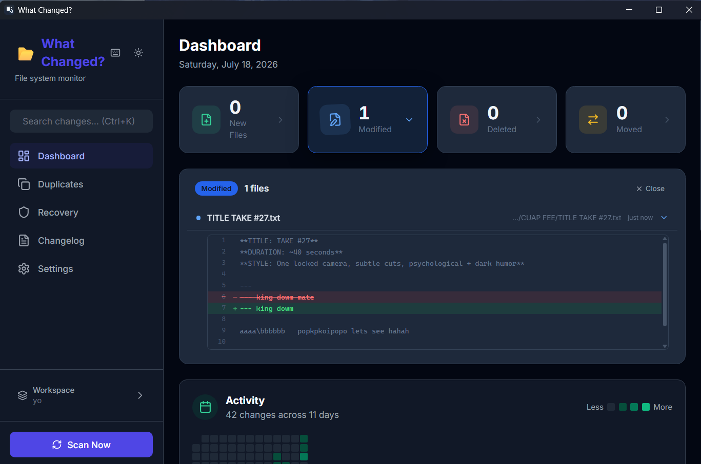
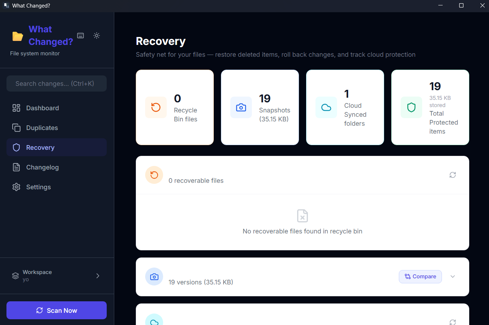

<div align="center">



# 📂 What Changed?

**A lightweight, privacy-first file system monitor that tracks every change across your projects.**

Never lose track of what changed, when, and why.

[](LICENSE)
[](https://tauri.app)
[](https://rust-lang.org)
[](https://react.dev)
[](#installation)

[Download](#installation) · [Features](#features) · [Screenshots](#screenshots) · [Contributing](#contributing)

</div>

---

<div align="center">

</div>

## Why What Changed?

Working on multiple projects? Ever wondered *"when did this file change?"* or *"what did I modify yesterday?"*

**What Changed?** runs quietly in the background, monitoring your folders and recording every file creation, modification, deletion, and rename — so you always know what changed, when, and where.

Built with [Tauri 2.0](https://tauri.app/) for a tiny footprint (~30MB RAM) and native performance.

---

## ✨ Features

### 📁 Smart File Monitoring
- **Real-time tracking** — Detects NEW, MODIFIED, DELETED, and MOVED files
- **Multiple folders** — Monitor unlimited directories simultaneously
- **Background scanning** — Configurable auto-scan intervals (1–60 minutes)
- **Ignore patterns** — Exclude files/folders with glob patterns

### 📸 File Snapshots
- **Automatic backups** — Creates compressed snapshots before changes
- **Zstd compression** — Efficient storage with 60-80% size reduction
- **One-click restore** — Revert any file to a previous version
- **Snapshot comparison** — Diff two versions side-by-side

### 🔍 Duplicates Detection
- **SHA-256 hashing** — Cryptographic accuracy for finding exact duplicates
- **Space savings** — See how much space wasted on duplicate files
- **Grouped results** — Organized by hash with file paths and sizes

### ♻️ Recycle Bin Recovery
- **Windows integration** — Scans system recycle bin for recoverable files
- **Smart matching** — Matches deleted files to your monitored folders
- **One-click restore** — Recover files directly from the app

### 🔗 Webhooks & Integrations
- **Discord, Slack, Teams** — Send change notifications to your team
- **Custom endpoints** — Any HTTP webhook URL
- **HMAC signatures** — Verify payload authenticity with shared secrets
- **SSRF protection** — Built-in DNS rebinding prevention

### 📊 Analytics & Reports
- **Activity heatmap** — Visualize when you're most productive
- **File type analytics** — See which file types dominate your projects
- **Storage trends** — Track disk usage over time
- **Export options** — CSV, JSON, and HTML reports

### 🔒 Privacy First
- **100% local** — All data stays on your machine
- **No telemetry** — Zero network calls (except webhooks you configure)
- **Encrypted storage** — AES-256 encryption for sensitive data
- **SQLite database** — Portable, well-understood, zero-dependency

---

## 📸 Screenshots

<div align="center">

| File Snapshots |
|-----------|
|  |

</div>

---

## 🚀 Installation

### Download

**Windows (recommended):**

Download the latest installer from [**GitHub Releases →**](https://github.com/Soodkrish03/What-Changed/releases/latest)

| Installer | Description |
|-----------|-------------|
| [`What-Changed_1.0.0_x64-setup.exe`](https://github.com/Soodkrish03/What-Changed/releases/latest) | **Recommended** — Standard Windows installer (NSIS) |
| [`What-Changed_1.0.0_x64_en-US.msi`](https://github.com/Soodkrish03/What-Changed/releases/latest) | MSI installer — Supports silent install & Group Policy deployment |

> **Quick download:** Grab the `.exe` for a familiar Next→Next→Install wizard.

### Windows Setup
1. Download the `.exe` or `.msi` from the link above
2. Run the installer and follow the prompts
3. Launch **What Changed?** from your Start Menu

### macOS & Linux

> ⚠️ **Not yet tested.** Tauri supports macOS and Linux, but this app has only been developed and tested on Windows. Some features (like Recycle Bin recovery) are Windows-only. Builds for macOS and Linux will be available once tested — you can try building from source below.

---

## 🛠️ Building from Source

### Prerequisites
- [Node.js](https://nodejs.org/) 18+
- [Rust](https://rustup.rs/) (latest stable)
- [Tauri CLI](https://tauri.app/): `cargo install tauri-cli`

### Setup
```bash
# Clone the repository
git clone https://github.com/Soodkrish03/What-Changed.git
cd What-Changed

# Install frontend dependencies
npm install

# Run in development mode
npm run tauri dev

# Build for production
npm run tauri build
```

The installers will be generated in `src-tauri/target/release/bundle/`.

---

## 📖 Quick Start

1. **Launch** the app — it starts in the system tray
2. **Add folders** to monitor via Settings or the onboarding wizard
3. **Let it run** — background scans happen automatically
4. **Check the Dashboard** to see all file changes at a glance
5. **Click any change** to see details, compare snapshots, or restore

---

## 🔧 Configuration

| Setting | Default | Description |
|---------|---------|-------------|
| **Scan Frequency** | 15 min | How often to scan monitored folders |
| **Auto-start** | Disabled | Launch on system startup |
| **Notifications** | Enabled | Desktop notifications for changes |
| **File Snapshots** | Enabled | Backup files before modification |
| **Dark Mode** | System | Follow system theme or manual toggle |

---

## 🏗️ Tech Stack

| Layer | Technology |
|-------|-----------|
| **Desktop Framework** | [Tauri 2.0](https://tauri.app/) |
| **Backend** | [Rust](https://www.rust-lang.org/) |
| **Frontend** | [React 18](https://react.dev/) + [TypeScript](https://www.typescriptlang.org/) |
| **Styling** | [Tailwind CSS](https://tailwindcss.com/) |
| **Database** | [SQLite](https://www.sqlite.org/) (via [rusqlite](https://github.com/rusqlite/rusqlite)) |
| **Charts** | [Recharts](https://recharts.org/) |
| **Icons** | [Lucide React](https://lucide.dev/) |

---

## 📁 Project Structure

```
What-Changed/
├── src/                        # React frontend
│   ├── components/
│   │   ├── Common/             # Shared UI (Layout, Sidebar, UpdateBanner)
│   │   ├── Dashboard/          # Main dashboard with stats & charts
│   │   ├── Settings/           # App configuration
│   │   ├── Duplicates/         # Duplicate file detection
│   │   ├── Recovery/           # Snapshots & recycle bin
│   │   └── Common/             # Changelog generator
│   ├── hooks/                  # Custom React hooks
│   └── lib/                    # Tauri API wrappers & types
├── src-tauri/                  # Rust backend
│   ├── src/
│   │   ├── lib.rs              # Main entry point & Tauri commands
│   │   ├── database.rs         # SQLite operations
│   │   ├── scanner.rs          # File system scanner
│   │   ├── scheduler.rs        # Background scan scheduler
│   │   ├── file_snapshots.rs   # Snapshot management
│   │   ├── webhook.rs          # Webhook delivery
│   │   └── ...
│   ├── icons/                  # App icons
│   └── Cargo.toml              # Rust dependencies
├── screenshots/                # App screenshots
└── package.json                # Frontend dependencies
```

---

## 🤝 Contributing

Contributions are welcome! Here's how:

1. **Fork** the repository
2. **Create** a feature branch: `git checkout -b feature/amazing-feature`
3. **Commit** your changes: `git commit -m 'Add amazing feature'`
4. **Push** to the branch: `git push origin feature/amazing-feature`
5. **Open** a Pull Request

### Development Tips
- Run `npm run tauri dev` for hot-reload development
- Rust changes require restart; frontend changes hot-reload
- Check `src-tauri/src/lib.rs` for all available Tauri commands

---

## 🐛 Bug Reports

Found a bug? Please [open an issue](https://github.com/Soodkrish03/What-Changed/issues/new) with:
- Steps to reproduce
- Expected behavior
- Actual behavior
- App version (`Settings → About`)

---

## 📄 License

This project is licensed under the **MIT License** — see the [LICENSE](LICENSE) file for details.

---

## 🙏 Acknowledgments

- [Tauri](https://tauri.app/) — Build smaller, faster, more secure desktop apps
- [React](https://react.dev/) — A JavaScript library for building user interfaces
- [Tailwind CSS](https://tailwindcss.com/) — Rapidly build modern websites
- [Lucide](https://lucide.dev/) — Beautiful, consistent icons
- [Recharts](https://recharts.org/) — Composable charting library

---

<div align="center">

**Built with ❤️ using Tauri + React + Rust**

[⬆ Back to top](#-what-changed)

</div>
